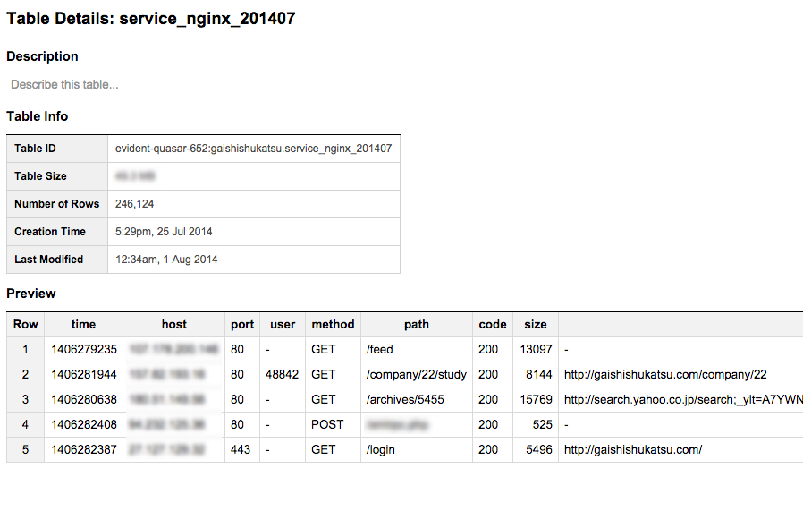

PHPカンファレンス2014

@who_you_me

# 今日から始める<br />PHPエンジニアのための<br />アクセスログ解析基盤構築入門

---

## お前 is 誰

- 祖山 寿雄(Hisao Soyama)
    - [Twitter](https://twitter.com/who_you_me)
    - [GitHub](https://github.com/who-you-me)
    - [Qiita](http://qiita.com/who_you_me)
        - ぜんぶ@who_you_me

<!-- .element: class="img-center" -->


---


---

## お前 is 誰

- 株式会社ハウテレビジョン所属

# 一緒に働きたい人を（ｒｙ
<!-- .element: class="fragment img-center" data-fragment-index="1" -->

---

## お前 is 誰

- Pythonの世界の住人
- 仕事はPHP
    - でも最近はあんまりコード書かずに開発環境整備ばっかしてる
- 統計、機械学習周りの集まりによく出没
- 社会学修士だったりする

---

# 何を話すのか

---

Webサーバのアクセスログを有効に活用することで、問題発生時の調査・解決が容易になるだけではなく、ユーザーの行動データを分析することでサービスの価値を飛躍的に向上させることができます。

昨今、Fluentd, Elasticsearch, BigQueryなど様々なツール、サービスの登場により、専門家でなくともアクセスログを蓄積、分析できる環境が整ってきました。

本セッションでは、Webエンジニアができるだけ手間をかけずにアクセスログの活用基盤を構築する方法を、実例を交えながらご説明します。

- Fluentdでアクセスログを集約する
- Elasticsearch + Kibanaで可視化する
- BigQueryでビッグデータ解析
- CakePHPとnginxを連携させ、任意の情報をアクセスログに記録する

---

# 三行で <!-- .element: style="background-color:white;" -->

<!-- .element: class="img-center-full" -->


---

## 話すこと

- アクセスログを
- Fluentdで
- ElasticsearchとBigQueryに送る

---

## 話さないこと

- 分析手法それ自体

---

# はじまり

---

# PHP is 何

---

# Hypertext Preprocessor

---

# PHPは、Webアプリケーションを作るための言語です

あってるよね…？

---

# Webアプリケーションを<br />運用すると何が残るか

---

# ログ

---

# ログ is どこ

---

## たぶんサーバのどこかにある

- アクセスログなら/var/log/httpdとか/var/log/nginxとか
- CakePHPならapp/tmp/logs

---

# 「ログインできないお客さんがいるので、ちょっと調査してもらえますか？」
<!-- .element: style="font-size:1.7em;" -->

---

# 調べてみるか

---


# ＿人人人人人人人＿<br />＞　生ログ目視　＜<br />￣Y^Y^Y^Y^Y^Y￣
<!-- .element: style="top:25%; color:yellow" -->

---

# 泣きたくなる

---

<!-- .element: class="img-center" -->


---

# 多少マシになったけど<br />やっぱ泣きたくなる

---

<!-- .element: class="img-center" -->


---

# もはや職人芸

---

# そもそも<br />古いログは圧縮されてる

---

```bash
$ mkdir /home/soyama/log
$ cp access.log.*.gz /home/soyama/log/
$ cd /home/soyama/log/
$ gunzip access.log.*.gz
```
<!-- .element: style="font-size:1.2em;" -->

<!-- .element: class="fragment img-center" data-fragment-index="1" -->


---

# 簡単にログ調べたい

---

# 簡単にログ調べたい<br />（迫真）

---

# それだけじゃない

---

# アクセスログ<br />is<br />ユーザーの行動履歴

---

## ユーザーの行動履歴

- うまく使えばいろんなことができる
    - このページを見た人はこんなページも見ています
    - 会員登録後、アクティブになったユーザーとそうじゃないユーザーは登録直後の行動にどんな違いがある？
- Google Analytics使えばだいたいのことはできるけど、高度な解析はできない

---

## ユーザーの行動履歴

- とはいえHadoopとかRedshiftとかはよく(ﾟ⊿ﾟ)ｼﾗﾈ
- 分析自体はExcelとかRとかに任せるとして、必要なデータを簡単に抽出したい
- 今は分析する人いないけど、いつかに備えてどこかに保存しておきたい

---

# やっと本題

---

## やりたいこと

1. ログ調査を効率化しよう
    - GUIで、誰でも使えるといい
    - ダッシュボードなんかもあるといい
2. ユーザーの行動解析をしよう
    - 必要なデータを素早く取り出したい
    - それなりに大量のデータも扱いたい

---

# 大事な前提

---

<!-- .element: class="img-center" -->


- 本職はWebエンジニア
- 開発環境整備とかもやってる
- スマホアプリもやることになってるらしい
- 家が遠いので遅く来て早く帰りたい

---

# 片手間でやりたい

---

# 1. ログ調査を効率化しよう

---

# Elasticsearch & Kibana

<!-- .element: class="img-center" style="margin-top: 30%;" -->


---

## Elasticsearch

- オープンソースの検索エンジン
- Java製
    - Solrとよく比較されてるみたい
- 分散型
- RESTful
    - つまり今風！

---

## Kibanaとは

- Elasticsearchに上っ被せするビジュアライズツール
- JavaScript製
    - クライアントサイドのみで動くので、サーバ側では静的ファイルを配信するだけでいい
- 探索的にログを検索することもできるし、ダッシュボード的に使うこともできる

---

<!-- .element: class="img-center" -->


---

# こんな感じ<br />（デモ）

---

# もう目grepには戻れない

---

# 次

---

# 2. ユーザーの行動解析をしよう

---

# BigQuery

<!-- .element: class="img-center" style="margin-top: 30%;" -->


---

## BigQueryとは

- Googleが提供するデータストア 兼 クエリエンジン
- SQLを大量のサーバで並列分散処理することで超高速に処理
    - つまりSQLライクなクエリが書ける
    - これ大きい！
- 安い
- 安い
- 安い

---


---

## BigQueryとは

- スキーマレスではない
    - JSONとかCSVでデータを投げる

---



---


---

## ちなみに

- BigQuery, Elasticsearchのどちらも、単体で1, 2の要件を満たすことはできる
    - Elasticsearchでももちろん集計処理ができる
    - ただし、クエリがちょっと馴染みにくい

<!-- .element: class="img-center" -->


---

## ちなみに

- Elasticsearchでももちろん集計処理ができる
    - ただし、データ量が多くなるとクラスタ組んだりしないといけなくなる
    - 片手間でやりたいのに！
- BigQueryならデータ投げるだけ投げておけば、後の面倒くさいことは全部Google先生がやってくれる

---

## ちなみに

- BigQueryでもアドホックに検索したり、ダッシュボード作ることができる
    - Tableauと接続できる
        - たぶん他のBIツールもいける
    - ただしTableauはそれなりにお金がかかる
    - クエリ課金のため、アドホックなクエリ投げまくるとお金がかかる

---

# どちらもセットアップ簡単なので、両方導入して使い分けちゃえばいいと思います

---

# さて

---

# こうした便利なツールやサービスを使うのはわかったけど

---

# どうやってウチのログをこいつらに入れればいいの？

---


---

## fluentdとは

- Ruby製のログ収集ツール
- 軽量
- プラグインが豊富

---


---

## fluentdとは

- いろんな入力に対応
    - テキストファイルのtail
    - syslog
    - HTTP POST

---

## fluentdとは

- いろんな所にログを送れる
    - ファイル出力
    - 他のfluentd
    - S3
    - MongoDB
    - Elasticsearch
    - BigQuery

---

## fluentdとは

- ログのフィルタリングなんかもできる
    - 必要なログだけ次に渡す
    - ログの中身によって出力先を変える
    - 新しいフィールドを追加する

---

<!-- .element: class="img-center" style="background-color:white;" -->


---

# フローの制御はタグで行う<br />（詳細はのちほど）

---

# やってみよう！

---

<!-- .element: class="img-center" -->


---

## fluentdで実際にログを流そう！

- Elasticsearchへはプラグインさえ入れれば、ほとんど設定することはない
    - fluent-plugin-elasticsearch
- BigQueryはサービス仕様上注意すべき点がいくつかある
    - fluentdの柔軟さですべて解決できる！

---

## BigQueryの注意点

- ストレージ課金　＋　クエリ課金
    - ユーザーの行動とあまり関係なさそうなログは弾いておきたい
    - テーブルを分割して1クエリあたりの処理量を抑えたい
        - 日毎、月毎とか

---

# config

---

https://gist.github.com/who-you-me/d37544f3147aa3eb4213

---

<!-- .element: class="img-center" -->


---

```no-highlight
<source>
  type tail
  format apache
  time_format %d/%b/%Y:%T %z
  path /var/log/nginx/access.log
  pos_file /var/log/td-agent/nginx.access.pos
  tag nginx.access
</source>
```

- tailでnginxのログをトラックする
- nginx.accessというタグを付与する

---

```no-highlight
<match nginx.access>
  type rewrite_tag_filter
  rewriterule1 path   ^/(files|img|js|css)/ ${tag}.clear
  rewriterule2 path   ^/favicon\.ico/       ${tag}.clear
  rewriterule3 path   (.+)                  ${tag}.accept
</match>
```

- fluent-plugin-rewrite-tag-filter を使って、正規表現でタグを付け替える
- 静的ファイルにはタグの末尾に'clear'をつける
    - BigQueryには保存しないための印
- それ以外には'accept'をつける

---

```no-highlight
<match nginx.access.accept>
  type record_reformer
  enable_ruby true
  tag ${tag}.${time.strftime('%Y%m')}
</match>
```

- fluent-plugin-record-reformer を使ってタグを書き換える
    - nginx.access.accept.201407 とか 201408とか
    - 末尾の年月によってBigQueryのテーブルを切り替える（次で）
- nginx.access.clear はここでは処理されない

---

## 最後のmatchはちょっと長い

- やりたいこと
 - すべてのログをElasticsearchに流す
 - タグにacceptがついたログだけはBigQueryに流す
 - タグの末尾の値（201408など）に応じて、BigQueryの保存先テーブルを変化させる

---

```no-highlight
<match nginx.access.**>
  type forest
  subtype copy
  remove_prefix nginx.access
```

- 複数の宛先に送るのに copy を使う
- タグの中身で動的に保存先テーブルを変えるのには、fluent-plugin-forest を使う

---

```no-highlight
  <template>
    <store>
      type elasticsearch
      host 192.168.100.1
      port 9200
      type_name access_log
      ...略
    </store>
  </template>
```

- templateセクションには、マッチした全てのログに対する共通の処理を書く
- Elasticsearchに送るだけなので、ここは簡単

---

```no-highlight
  <case accept.*>
    <store>
      type bigquery
      method insert

      auth_method private_key
      email XXXXXXXXXX@developer.gserviceaccount.com
      private_key_path /etc/td-agent/XXXXXXXXXX.p12

      project XXXXXXXXXX
      dataset XXXXXXXXXX
      table nginx_${tag_parts[-1]}

      time_format %s
      time_field time
      schema_path /etc/td-agent/schema.json
    </store>
  </case>
```
<!-- .element: style="font-size:0.35em;" -->

---

- case セクションはPHPのswitch-caseと同じようなもの
    - タグに'accept'がついたログ（BigQueryに入れたいログ）だけ処理する
- ${tag_parts[-1]} がミソ
    - ${tag_parts[-1]} とすることで、タグの末尾の値を埋め込むことができる
        - accept.201408 なら 201408
    - これによって、8月なら nginx_201408 、9月なら nginx_201409 といった次第に、保存先のテーブルを変化させられる

---

## わかったこと

- fluentdの柔軟性ヤバい！！
    - 困ったことがあれば、だいたいのことは既存のプラグインが解決してくれる
    - Rubyが書ければ自分でプラグインも書ける
- これだけプラグイン入れて複雑なことやっても、負荷が少ない

---

## 注意点

- クライアントサイドで動く
- AJAXでElasticsearchのAPIをクライアントから直接叩いている
- Elasticsearchには認証機能とかない
- iptablesで縛る or リバースプロキシ経由にして、Webサーバで認証する
- Kibana4のBetaが出たので、動向追いかけておくといいかも知れない

