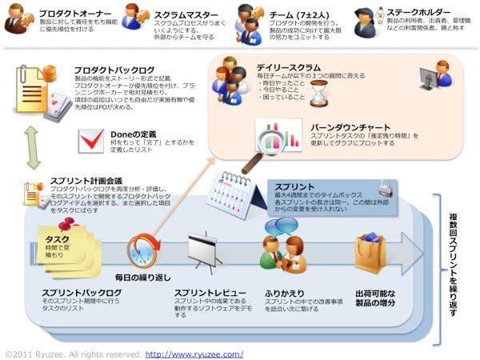
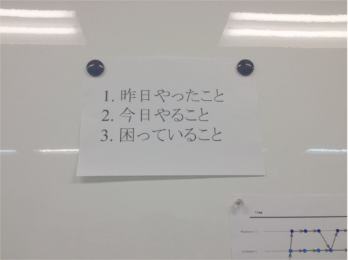
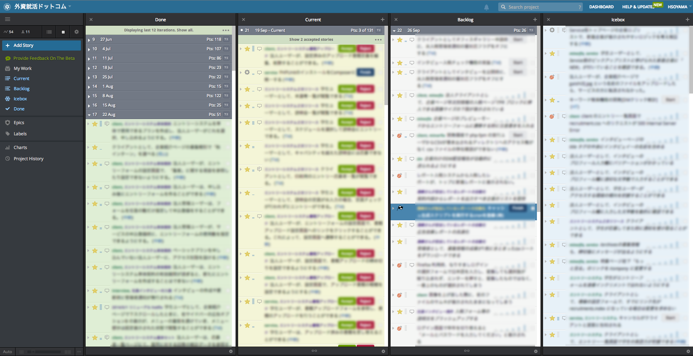
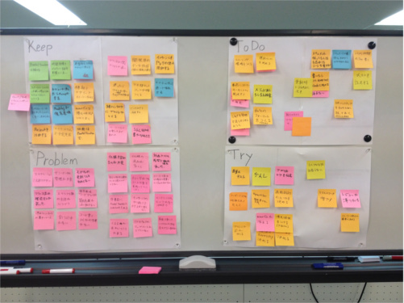

# 負債を解消する （アジャイル編）

by Hisao Soyama ([@who_you_me](https://twitter.com/who_you_me))

---

## お前誰よ

- 祖山 寿雄(Hisao Soyama)
    - [Twitter](https://twitter.com/who_you_me)
    - [GitHub](https://github.com/who-you-me)
    - [Qiita](http://qiita.com/who_you_me)
        - ぜんぶ@who_you_me
- 株式会社ハウテレビジョン所属
- スタートアップなので必然的にフルスタックにならざるを得ない系エンジニア

---

## お前誰よ

- 何故か社会学の修士号を所持
    - テキストマイニングやネットワーク分析をやってた
- 新卒で某ISPに入社（2012年）
    - 全く未経験のネットワークエンジニアになる
    - インフラエンジニアのつらみを味わう
- コードが書きたいのでハウテレビジョンに入社
    - 2014年4月

---

# はじめに

---

## 急成長を遂げた外資就活ドットコム

- 2人→8人以上のエンジニアチームに
- 営業、事務などエンジニア以外のメンバーも増加

---

# なにがおこったか

---

## 暗黙知の山

- チームが拡大し、阿吽の呼吸では回らなくなる

「ここってどういう仕様になってるんだっけ？」  
「◯◯さんに聞かないとわからない…」
<!-- .element: class="fragment" data-fragment-index="1" -->

本人登場
<!-- .element: class="fragment" data-fragment-index="2" -->

「ここってどうなってるんですか？」  
「あれ、どうだったかな…」
<!-- .element: class="fragment" data-fragment-index="3" -->

# 本人も覚えてない！！！
<!-- .element: class="fragment" data-fragment-index="4" style="background-color:white;"-->

---

## 炎上するプロジェクト

- 開発のボリュームが急拡大し、パンクする

「これいつまでに終わるの？」  
「うーん、これぐらいかな（適当」
<!-- .element: class="fragment" data-fragment-index="1" -->

どう見ても間に合わなそう
<!-- .element: class="fragment" data-fragment-index="2" -->

「これ終わるの？　進捗何％ぐらい？」
<!-- .element: class="fragment" data-fragment-index="3" -->

「……」
<!-- .element: class="fragment" data-fragment-index="4" -->

「し、死んでる！？」
<!-- .element: class="fragment" data-fragment-index="5" -->

# ＿人人 人人＿ ＞ 突然の死 ＜ ￣Y^Y^Y^Y￣
<!-- .element: class="fragment" data-fragment-index="6" style="background-color:white;" -->

---

# 死んでません

念のため…

---

## だけど、ずっとそれじゃいけない

- スターアップが成功して、ビジネス的に1つステップを超えた時、壁にぶつかる
- それが私がジョインした時でした

---

# 当時の私のスペック

---

- もともとPythonista
- ネットワークエンジニアを1年ほど
    - 1行もコードを書かない
    - Ciscoのコマンドならアホほど叩いた
- チーム開発？　あーそれ研修でやったわ
    - 5人チームで1ヶ月
    - スクラムでやった
- その後、先輩に誘われて「スクラムを広めよう」みたいなワークグループに入ってた
    - スクラムの何たるかはそこで知った

---

仕事でコードを書きまくれる！　と胸を踊らせて入社したら、現場は絶賛炎上中！！！！

- 5/1に大規模なリニューアルがあるらしい
- 終わりそうにない
- ヤバい、どのくらいヤバいのかっていうと、「どのくらいヤバいのか」すら把握できないほどヤバい

---

# これはどこかで聞いた話だぞ…

---

# ということで

---

# Let's Scrum <!-- .element: style="background-color:white;" -->

---

<!-- .element: style="width:900px;" -->

---

# 本題に入る前に

---

# 大事な前提

---

- リリース計画
- スプリント計画
- デイリースクラム
- スプリントレビュー
- レトロスペクティブ
- アジャイルな見積もり
- ベロシティの計測
- かんばん
- etc...

---

# 全部やらなくていい

---

## 全部やらなくていい

- 「次のプロジェクトからスクラムでやろう」なんて余裕はない
    - 問題山積みで、早く何とかしないとﾀﾋぬ
- 必要なこと、すぐにできそうなことからやろう

---

- 幸い、プロセス面に関しては技術面と違い、Yakの毛を延ばさくてもいい（ことが多い）
    - 中途半端に「chefやろう」「Vagrantやろう」とすると後に負債になり得る
    - 中途半端にスクラムやっても負債にはならない
        - 駄目ならすぐやめればいい
    - 「うまくいかなかったね…」で終わってしまい、以後スクラムを取り入れにくくなるリスクはある

---

## 具体的になにをやったか

- 取り入れた順番にご紹介

---

## デイリースクラム

>スプリント期間中は、昨日した事、今日やる事、問題点の３点のみを、短く報告し合うミーティングを毎日開きます。このミーティングは、日々の作業内容を設定し、また、進捗を妨げる問題を素早く取り除く機会を得ることで、チームが円滑に作業を進められるように手助けします。このミーティングを デイリースクラムミーティング （朝会） と呼びます。

<!-- .element: style="text-align:right;" -->
http://agile.esm.co.jp/scrum/about.html

---

## デイリースクラム

- チームが大きくなり、フリーランスやインターンも増えた
    - 各自の進捗が把握しづらくなってきた
    - 特に用がないと一日に一度も会話しないこともある
- 進捗を把握し、何か詰まっていることや問題があればすぐに気付けるようにするために導入
    - 「昨日やったこと」「今日やること」「困っていること」を報告するオーソドックスなやり方

---

画像1

---

<!-- .element: style="width: 600px; margin: 0 auto;" -->

---

## デイリースクラム

- 狙いは達成できた
    - 「今振られてるタスクが今日中ぐらいには終わりそうです」
    - 「（マジか。次お願いすることまとめておこう。。）」
- デイリースクラムをきっかけとして会話が増えた
    - 「ちょっとここで困ってます」
    - 「あーそれ私も前に詰まったので、後で教えますよ」

---

## スプリント計画

>スプリント （2〜4週間のイテレーション）の開始時に、イテレーション計画のためのミーティングを開きます。 
>プロダクトオーナーが優先順位付けした プロダクトバックログ を元に、 スクラムチームがスプリント期間内に達成できる機能を選択します。選択した機能を実現するための作業を詳細化し、 プロダクトバックログ から スプリントバックログ へ落とし込みます。 
>スクラムチームは、スプリントバックログ上の作業を本スプリント期間中に完了することをコミットします。管理者の作業指示でチームメンバーに作業を割り当てるのではなく、チーム自身がやるべき作業について話し合いコミットすることで、より深く作業内容について理解できます。このミーティングを スプリンントプランニングミーティング と呼びます。
<!-- .element: style="font-size:70%;" -->

<!-- .element: style="text-align:right;" -->
http://agile.esm.co.jp/scrum/about.html

---

## スプリント計画

- 「どの順番で、いつ、何が完成するのか」が把握できなくなっていた
    - 開発計画の資料があちこちに分散して存在しており、どこを見ればいいのかわからない
- 「ひと目で見てわかる開発計画（＝バックログ）」を作るために導入
    - 2週間に一度のタイミングで、このスプリントに実装するフィーチャを洗い出し、見積もる

---

## スプリント計画

- 教科書的なやり方はフィットしなかった
    - アジャイルなチームは機能横断的
    - とはいえ、エンジニア数人のスタートアップでは、どうしても各自やることがバラバラになる
        - サービス開発する人、バグ直す人、開発環境整備する人、など
    - そのため、全員揃って見積もりをする意味があまりない

---

## スプリント計画

- 現在では、1機能ごとに1〜2人のミニチームのような形になり、そのメンバーで見積もり
- 「スプリント」も特に設けていない
    - 「自社サービスだと延々と切れ目なく開発続くから、2週間毎にがっつり計画し続けるのはしんどいよね」的なことを@naoya_itoがどこかで言ってた（気がする）

---

## スプリント計画

- 「優先順位をつけ、上から順に開発する」という原則は生きており、重要！

---

## アジャイルなタスク管理

- アジャイルな開発にはアジャイルなツールが必要
    - 開発計画を一元管理できるツール
- PivotalTrackerを採用
    - 決め手はシンプルさ
    - Redmineは入れるのが面倒なのと、機能が豊富すぎる

---

<!-- .element: style="width:900px;" -->

---

## アジャイルなタスク管理

- 「開発フローに合わせてツールをカスタマイズする」のではなく、「開発フローをツールに合わせる」ことが大事
- PivotalTrackerはシンプルで、カスタマイズはあまりできない
- 裏を返せば「PivotalTrackerに開発フローを合わせることで、自然とスクラムになる」ということ
    - 管理ツールも「レールに乗る」という発想

---

## ふりかえり（レトロスペクティブ）

>スプリント終了時には、スプリントレビューの他に、 ふりかえり のミーティングを開きます。ふりかえりは、日々の仕事の進め方を話し合う改善活動の場です。

<!-- .element: style="text-align:right;" -->
http://agile.esm.co.jp/scrum/about.html

---

## ふりかえり（レトロスペクティブ）

- 各自が思っている問題点を吐き出させ、できることから改善していきたい
    - いわゆる「カイゼン」。スクラムの肝

---

## ふりかえり（レトロスペクティブ）

- KPTTという手法を導入
    - 開発におけるKeep（続けていきたいこと）, Problem（問題点）を洗い出す
    - それらをもとに、Try（やってみたいこと）を出す
    - Tryの中から、次のサイクルで実際に取り組むことをToDoとして抽出
- 2週間に1回行う

---

<!-- .element: style="margin: 0 auto;" -->

<!-- .element: style="width: 800px;" -->

---

## ふりかえり（レトロスペクティブ）

- 問題点が可視化され、改善のプロセスを回るようになった
    - 「この人こんなこと思ってたんだ」と参考になることも
- 定期的に開催することで、課題が放置されなくなった

<!-- .element: class="fragment" data-fragment-index="1" style="width: 400px; margin: 0 auto;" -->

---

## アジャイルな見積もり

- 見積もれないと計画立てられないので、これは必須

- プランニングポーカーを採用
- 「インタビューページの開発」のような大きな単位で見積もる
    - フィーチャ単位で見積もると時間が掛かり過ぎる

---

## アジャイルな見積もり

- 不定期開催
- フィボナッチ数で相対見積もり

~~~haskell
fib = 0 : 1 : zipWith (+) fib (tail fib)
~~~

---

## アジャイルな見積もり

- 見積もりは大変
    - 「どうやって実装するか決めないと見積もれない」
    - 実装の詳細に踏み込んでしまい、長引くことが多い
- 消耗するので、終わったら飲みに行く空気になることが多い
- 大変だが必須なので、金曜の午後とかに時間を取ってゆっくりやろう

---

# まとめ

---

## 炎上してた開発現場にスクラムを導入した結果ｗｗｗｗｗ

- できたこと
    - 開発案件を優先度順に並べて管理することで、計画が見える化
    - PivotalTrackerの導入によるタスクの一元管理
        - + デイリースクラムで進捗の可視化
    - デイリースクラムやふりかえりで問題点を可視化される
        - 改善のプロセスが回る

---

- まだ残っている課題
    - 仕様の詳細について食い違いが発生することが多い
    - スプリント単位で開発できていない
    - 人が足りないのはどうしようもない

---

## 最後に

- 10人いれば10通りのスクラムがある
    - 同じ組織でも、規模が変われば最適なやり方は変わる
- まだ足りないことはあるし、今できていても今後変化する必要に迫られることもあるだろう
    - 変わり続けるのがアジャイルのあり方

---

私たちの話に少しでも興味を持ってくれた方
「こいつらを変えたい」と思う方
「自分が変わりたい」と思う方

- 一度オフィスに遊びに来てください
